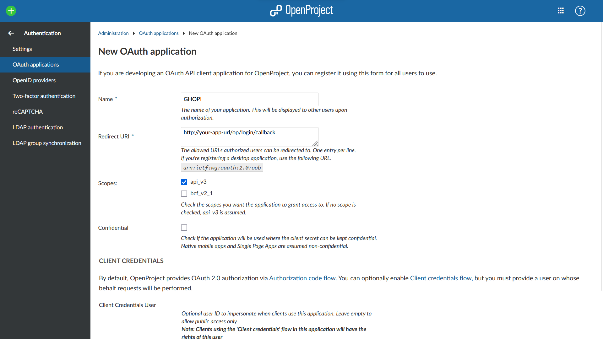
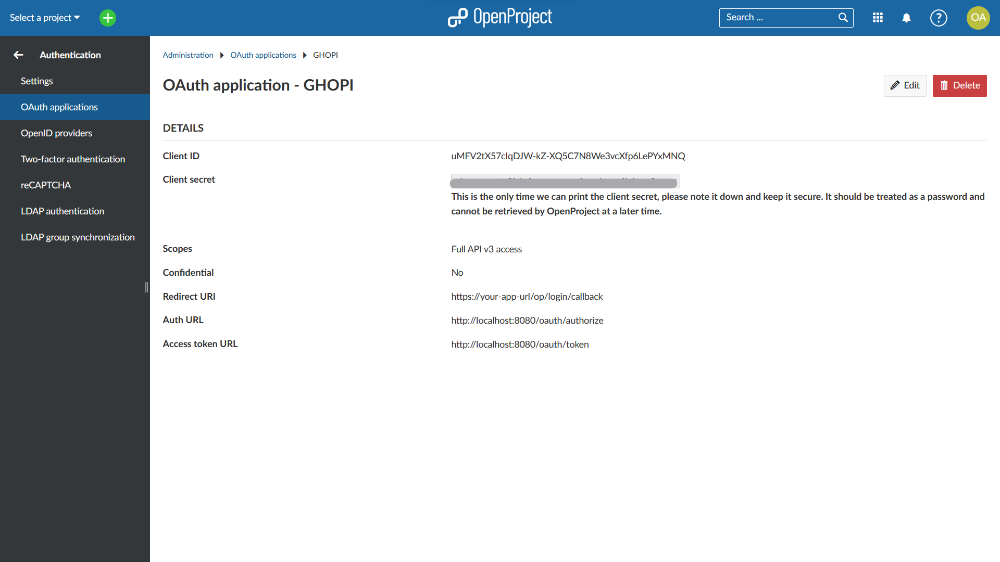
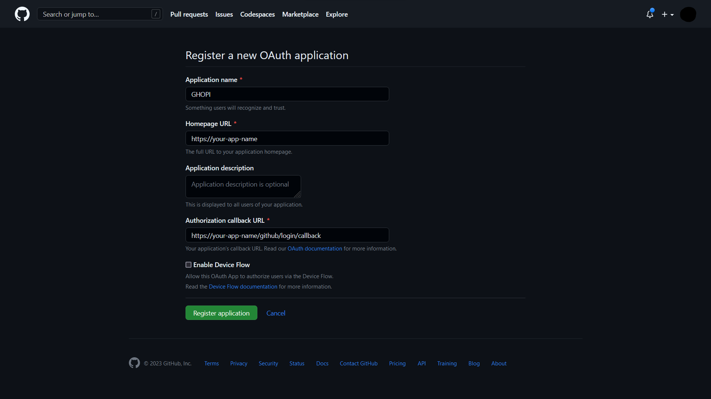
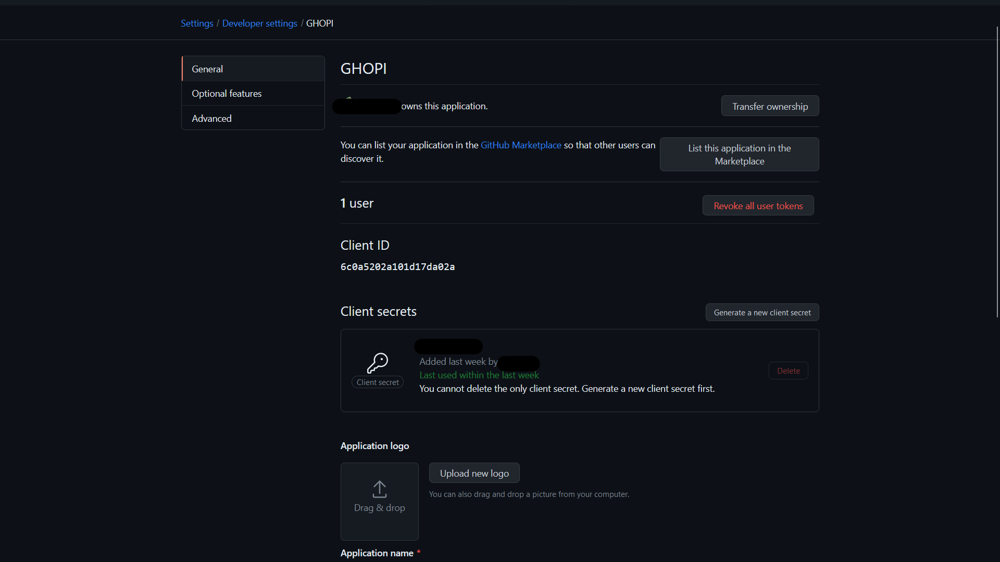

# GHOPI

> Version 1.2.0

#### Table of contents
- [GHOPI](#ghopi)
      - [Table of contents](#table-of-contents)
  - [Prerequisites](#prerequisites)
  - [Set up](#set-up)
    - [Using Docker](#using-docker)
    - [Using Go](#using-go)
    - [Setting up .env file](#setting-up-env-file)
      - [Open Project app](#open-project-app)
      - [Github app](#github-app)
      - [Port](#port)
      - [URL paths](#url-paths)
  - [Work in progress](#work-in-progress)
  - [License](#license)

---

Welcome to the GHOPI, our app aim is to create a channel of communication between Open Project and Github. This service must give project leaders and SCRUM masters more freedom and let them focus on their work and avoid as much as possible unnecessary stops to change repository permissions, create new branches, open and close pull requests, etc. 

GHOPI makes use of the RESTful APIs of Open Project and Github to get information from them and synchronize both apps. This will be possible thanks to the webhooks provided by them which are easily configurable.

GHOPI is capable of creating branches in the repository for each task created on Open Project, give or remove permissions to people working on the tasks of each project, send a message into Open Project tasks when a Pull request is opened or closed, and many more features to reduce the waste of time.

It also has a web interface which will provide an easy configuration process and also logs viewer to check every information or error happening into the app.


## Prerequisites
[Go](https://go.dev/) version 1.19.1 or higher.
[Docker](https://www.docker.com/) version 24.0.5 or higher.
Any technology capable of make your app instance public, such as apache or nginx among others.

## Set up

### Using Docker

As the GHOPI image is not public yet, you will need to build and run the image manually. 

Firstly, clone this repository into your computer using git. Then create a `.env` file in GHOPI's path as explained in section [Setting up .env file](#setting-up-.env-file). Finally, use a terminal to execute the following commands and run the image on GHOPI. Be aware of changing the path to your own GHOPI's path and the config volume path with the absolute path to your config folder.

```shell
cd </your/ghopi/path> 
source .env
docker build -t ghopi:latest .
docker run \
    -e GITHUB_CLIENTID=$GITHUB_CLIENTID \
    -e GITHUB_SECRETID=$GITHUB_SECRETID \
    -e OPENPROJECT_CLIENTID=$OPENPROJECT_CLIENTID \
    -e OPENPROJECT_SECRETID=$OPENPROJECT_SECRETID \
    -e PORT=$PORT \
    -p $PORT:$PORT \
    -v <abs/config/path>:/.config \
    --name ghopi \
    -e URL_SUBPATH=$URL_SUBPATH \
    ghopi:latest
```

This shell commands will set up and launch GHOPI free to use. Then use your chosen technology to launch the app publicly.

<!-- > **NOTE**: A `deploy.sh` file is provided so the build and running of the image may be done automatically. Be sure to have the .env file filled up. -->

### Using Go 

Firstly, clone this repository into your computer using git. Then create a `.env` file as explained in section [Setting up .env file](#setting-up-.env-file). Finally execute the command:
 
```shell
go build -o GHOPI.exe main.go
```

Which will create an executable file, named `GHOPI.exe`, to use the app. Then use your chosen technology to launch the app publicly.

### Setting up .env file

To get this app to work you firstly need to set up a .env file which must include the client id and secret id of Github and Open Project to be able to log in them. This .env file must be in the same folder as the `GHOPI.exe` app or in the project root folder. There is a template of the .env file at [.env.template](.env.template) you may look at.

#### Open Project app

In your Open Project instance go to `Administration > Authentication > OAuth Applications`, where you can add a new application pushing the `Add` button.

In the configuration page opened just fill in the gaps with GHOPI's information, in the redirect URI be sure to write `https://your-app-url/op/login/callback` where `https://your-app-url` is your GHOPI's path which **must** be public.



Once you have created it, the credentials will be shown and you will have to save the Client ID and the Client secret into the .env file with the names: `OPENPROJECT_CLIENTID` and `OPENPROJECT_SECRETID`.



#### Github app

To configure Github oauth go to `Settings > Developer settings > OAuth apps` and click the `new oauth app` button.

In the configuration page you must fill the Homepage URL field with `https://your-app-url` and the Authorization callback URL with `https://your-app-url/github/login/callback`, where `https://your-app-url` is your GHOPI's path which **must** be public.



Once the app is created new client ID and Secret client will be created. You have to save them into the .env file with the names: `GITHUB_CLIENTID` and `GITHUB_SECRETID`.



#### Port

In the .env variables it will also be necesary to indicate the port on which you will expose the app using the keyword `PORT`, as shown in [.env.template](.env.template).

By default the port will be `8080`.

#### URL Paths

In some cases you will need to deploy the APP somewhere different from the root site ("*https://your-webpage/*"). An environment variable has been created with this purpose. Using the keyword `URL_SUBPATH`, you may use the subpath needed. If you do not need a subpath and want to use the root path, give this variable an empty value or leave it by default. This shall be seen in the [.env.template](.env.template).

By default the subpath is empty, so the app will use the root path.

## Work in progress

We are working on giving some API function the need of an API key, so the app is much more secure when running publicly.

## License

This project is licensed under GNU v3.0 license. Read it in [LICENSE.md](https://github.com/JCruiz15/GHOPI/blob/main/LICENSE.md) file.
